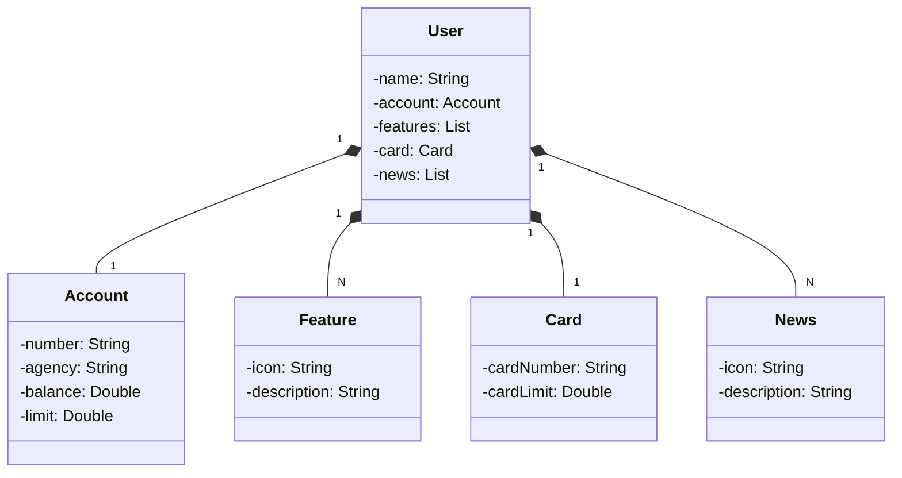

# Santander Bootcamp Java Backend 2023
Criação de RESTful API para finalizar o projeto do bootcamp santander java backend 2023

## Diagrama de classes da API

```mermaid
classDiagram
  class User {
    -name: String
    -account: Account
    -features: List<Feature>
    -card: Card
    -news: List<News>
  }

  class Account {
    -number: String
    -agency: String
    -balance: Double
    -limit: Double
  }

  class Feature {
    -icon: String
    -description: String
  }

  class Card {
    -cardNumber: String
    -cardLimit: Double
  }

  class News {
    -icon: String
    -description: String
  }

  User "1" *-- "1" Account
  User "1" *-- "N" Feature
  User "1" *-- "1" Card
  User "1" *-- "N" News
```
